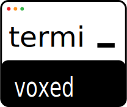

# TermiVoxed

<div align="center">



**Terminal Based Video Voice-Over Dubbing Tool for Content Creators**
**Add professional AI voice-overs and styled subtitles to your videos**

[](https://www.python.org/downloads/)
[](https://www.gnu.org/licenses/agpl-3.0)
[](https://ffmpeg.org/)
[](https://github.com/rany2/edge-tts)

</div>

---

## Table of Contents

- [Features](#features)
- [Prerequisites](#prerequisites)
- [Installation](#installation)
- [Usage](#usage)
- [Configuration](#configuration)
- [Project Structure](#project-structure)
- [Troubleshooting](#troubleshooting)
- [Contributing](#contributing)
- [License](#license)
- [Credits](#credits)

---

## Features

### Core Capabilities

- **🎬 Console-Based Interface**: Clean, interactive terminal UI using Rich library
- **🎙️ AI Voice-Over Generation**: 200+ voices in 80+ languages via Microsoft Edge TTS
- **📝 Advanced Subtitle Styling**: Full control over fonts, colors, borders, positioning
- **🔊 Audio Mixing**: Combine video audio with voice-overs seamlessly
- **🎨 Google Fonts Integration**: Auto-download and install any Google Font
- **⚡ FFmpeg Powered**: Professional video processing with proven patterns
- **💾 Project Management**: Save and resume projects with JSON-based storage
- **🎵 Background Music**: Add music with automatic looping and fade effects
- **🎞️ Multi-Video Projects**: Work with multiple videos in a single project
- **🔗 Video Combination**: Combine multiple edited videos into one seamless output

### Advanced Features

- **Interactive Voice Preview**: Listen to voices before selection
- **Interactive File Picker**: Browse and multi-select videos with arrow key navigation
- **Automatic Audio Sync**: Smart segment extension for audio/video matching
- **Multi-Language Support**: 16 languages with language-specific fonts
- **Subtitle Border Controls**: Enable/disable borders, adjust colors and thickness
- **Video Compatibility Checking**: Validates videos can be combined (orientation, aspect ratio)
- **Flexible Export Options**: Export single videos, all individually, or combined
- **Video Orientation Detection**: Automatic detection of landscape/portrait/square videos
- **Cross-Platform**: Works on Windows, macOS, and Linux
- **Docker Support**: Containerized deployment option
- **Caching System**: TTS cache for faster repeated operations
- **Project Versioning**: Backwards compatible with single-video projects
- **Proxy Support**: Corporate proxy support for TTS service with automatic fallback (see [PROXY_SETUP.md](PROXY_SETUP.md))

---

## Prerequisites

### Required Software

1. **Python 3.8 or higher**

   - Check version: `python3 --version` or `python --version`
   - Download: https://www.python.org/downloads/

2. **FFmpeg** (includes ffprobe)

   - Check version: `ffmpeg -version`
   - Installation:
     - **macOS**: `brew install ffmpeg`
     - **Ubuntu/Debian**: `sudo apt-get install ffmpeg`
     - **Fedora**: `sudo dnf install ffmpeg`
     - **Arch**: `sudo pacman -S ffmpeg`
     - **Windows (Chocolatey)**: `choco install ffmpeg`
     - **Windows (Scoop)**: `scoop install ffmpeg`
     - **Manual**: https://ffmpeg.org/download.html

3. **Git** (for cloning the repository)
   - Check version: `git --version`
   - Download: https://git-scm.com/downloads

---

## Installation

### Quick Install (Recommended)

#### On macOS / Linux

```bash
# Clone the repository
git clone https://github.com/san-gitlogin/termivoxed.git
cd termivoxed

# Run the setup script
chmod +x setup.sh
./setup.sh

# Run the application
./run.sh
```

#### On Windows (Command Prompt)

```batch
REM Clone the repository
git clone https://github.com/san-gitlogin/termivoxed.git
cd termivoxed

REM Run the setup script
setup.bat

REM Run the application
run.bat
```

#### On Windows (PowerShell)

```powershell
# Clone the repository
git clone https://github.com/san-gitlogin/termivoxed.git
cd termivoxed

# Run the setup script
.\setup.ps1

# Run the application
.\run.ps1
```

### Manual Installation

```bash
# 1. Clone and navigate
git clone https://github.com/san-gitlogin/termivoxed.git
cd termivoxed

# 2. Create virtual environment
python3 -m venv venv

# 3. Activate virtual environment
source venv/bin/activate  # macOS/Linux
# venv\Scripts\activate.bat  # Windows CMD
# venv\Scripts\Activate.ps1  # Windows PowerShell

# 4. Install dependencies
pip install --upgrade pip
pip install -r requirements.txt

# 5. Copy environment configuration
cp .env.example .env

# 6. Run the application
python main.py
```

### Docker Installation

```bash
# Clone the repository
git clone https://github.com/san-gitlogin/termivoxed.git
cd termivoxed

# Build and run with Docker Compose
docker-compose up -d

# Access the container
docker exec -it termivoxed /bin/bash

# Run the editor
python main.py
```

### Package Installation

```bash
# Install as package
pip install .

# Run using command
termivoxed
# or
tvx
```

---

## Usage

### Starting the Application

```bash
python main.py
# or if installed as package
termivoxed
```

### Basic Workflow

#### Single Video Project

1. **Create Project** → Select one or more videos using interactive file picker
2. **Add Segments** → Define voice-over sections with timing for active video
3. **Select Voices** → Choose from 200+ voices with preview
4. **Style Subtitles** → Customize fonts, colors, borders
5. **Export Video** → Generate final video with voice-overs

#### Multi-Video Project

1. **Create Project** → Select multiple videos using interactive file picker
2. **Manage Videos** → Add, remove, reorder, or select active video for editing
3. **Edit Each Video** → Switch between videos and add segments to each
4. **Video Compatibility** → System validates videos can be combined
5. **Export Options**:
   - Export active video only
   - Export all videos individually
   - Export combined video (all videos in sequence)

### Voice Selection

Interactive voice selector featuring:

- 200+ voices in 80+ languages
- Voice preview with audio playback
- Arrow key navigation
- Search and filter

### Subtitle Styling

Full control over:

- **Font**: Google Fonts (auto-installed)
- **Size**: Font size in pixels
- **Color**: Text color (ASS format)
- **Position**: Vertical offset from bottom
- **Borders**: Style, width, color, shadow

### Multi-Video Features

Powerful multi-video capabilities:

- **Interactive File Picker**: Browse folders and multi-select videos with Space key
- **Video Management**: Add, remove, reorder videos in your project
- **Active Video Selection**: Switch between videos for editing
- **Compatibility Checking**: Automatic validation of orientation and aspect ratio
- **Orientation Detection**: Landscape (🖥), Portrait (📱), or Square (⬜)
- **Smart Export**: Three export modes for maximum flexibility
- **Video Metadata**: Resolution, FPS, codec information for each video
- **Seamless Combination**: Merge multiple edited videos into one

---

## Configuration

Edit `.env` file to customize paths and settings:

```bash
# Storage
STORAGE_DIR=storage
TEMP_DIR=storage/temp
OUTPUT_DIR=storage/output

# FFmpeg paths
FFMPEG_PATH=ffmpeg
FFPROBE_PATH=ffprobe

# Quality presets (CRF: lower = better quality)
LOSSLESS_CRF=0
HIGH_CRF=18
BALANCED_CRF=23

# Audio mixing (volume in dB)
TTS_VOLUME_BOOST=6
BGM_VOLUME_REDUCTION=15
```

### Check Dependencies

```bash
python check_dependencies.py
```

---

## Project Structure

```
termivoxed/
├── main.py              # Entry point with multi-video support
├── config.py            # Configuration
├── requirements.txt     # Dependencies
├── backend/             # FFmpeg, TTS, subtitles
├── core/
│   ├── export_pipeline.py  # Export orchestration
│   └── video_combiner.py   # Multi-video combination
├── models/
│   ├── project.py       # Multi-video project model
│   ├── video.py         # Individual video model (NEW)
│   ├── timeline.py      # Timeline management
│   └── segment.py       # Segment model
├── utils/
│   ├── file_picker.py   # Interactive video file picker (NEW)
│   └── logger.py        # Logging utilities
├── storage/             # Projects and cache
├── setup.sh/bat/ps1     # Setup scripts
├── run.sh/bat/ps1       # Run scripts
├── Dockerfile           # Docker image
└── docker-compose.yml   # Docker Compose
```

---

## Troubleshooting

### FFmpeg Not Found

**Solution**: Install FFmpeg (see [Prerequisites](#prerequisites))

### Package Import Errors

**Solution**: `pip install -r requirements.txt`

### Permission Denied (Unix/Linux/macOS)

**Solution**: `chmod +x setup.sh run.sh`

### PowerShell Execution Policy (Windows)

**Solution**: `Set-ExecutionPolicy -ExecutionPolicy RemoteSigned -Scope CurrentUser`

### Voice Preview Issues

Voice selection works without preview. Update pygame if needed: `pip install --upgrade pygame`

---

## Contributing

Contributions welcome! Please see [CONTRIBUTING.md](CONTRIBUTING.md) for guidelines.

```bash
# Fork, clone, and create branch
git clone https://github.com/YOUR_USERNAME/termivoxed.git
cd termivoxed
git checkout -b feature/your-feature

# Install dev dependencies
pip install -r requirements-dev.txt

# Make changes, commit, and push
git commit -m "Add: feature description"
git push origin feature/your-feature
```

---

## License

GNU AGPL v3 License - see [LICENSE](LICENSE) file for details.

---

## Credits

### Author

**Santhosh T**

### Acknowledgments

This project was developed with the assistance of **Claude** (Anthropic's AI assistant).

### Key Dependencies

- **[FFmpeg](https://github.com/FFmpeg/FFmpeg)** - A complete, cross-platform solution for video and audio processing
- **[Edge-TTS](https://github.com/rany2/edge-tts)** - Microsoft Edge's online text-to-speech service for generating high-quality AI voices

### Technologies

- **Python** - Core language
- **FFmpeg** - Video processing
- **Edge-TTS** - Text-to-speech
- **Rich** - Terminal UI
- **Pydantic** - Data validation
- **Loguru** - Logging
- **Inquirer** - Interactive prompts
- **Pygame** - Audio playback

---

<div align="center">


**Made with ❤️ by Santhosh T**

[Report Bug](https://github.com/san-gitlogin/termivoxed/issues) · [Request Feature](https://github.com/san-gitlogin/termivoxed/issues)

</div>
